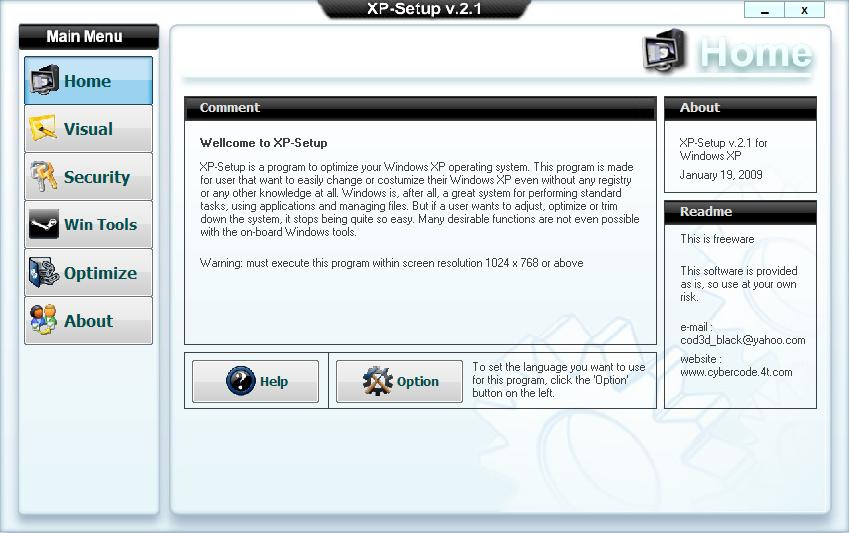



## xp\-setup v2\.1 UPDATED

### Description

Wellcome to XP-Setup

XP-Setup is a program to optimize your Windows XP operating system. This program is made for user that want to easily change or costumize their Windows XP even without any registry or any other knowledge at all.

Windows is, after all, a great system for performing standard tasks, using applications and managing files. But if a user wants to adjust, optimize or trim down the system, it stops being quite so easy. Many desirable functions are not even possible with the on-board Windows tools.

There are so much program to tweak Windows XP, but most of them require you to buy the software and the price usually high enough for you to think better not buy that product.

This program is Freeware. Dont sale it to another, just give it for FREE.
 
### More Info
 

             |
---                |---
**Submitted On**   |2009-01-19 08:33:54
**By**             |[coded\_black](https://github.com/Planet-Source-Code/PSCIndex/blob/master/ByAuthor/coded-black.md)
**Level**          |Intermediate
**User Rating**    |4.8 (38 globes from 8 users)
**Compatibility**  |VB 6\.0
**Category**       |[Complete Applications](https://github.com/Planet-Source-Code/PSCIndex/blob/master/ByCategory/complete-applications__1-27.md)
**World**          |[Visual Basic](https://github.com/Planet-Source-Code/PSCIndex/blob/master/ByWorld/visual-basic.md)
**Archive File**   |[xp\-setup\_v2140951202009\.zip](https://github.com/Planet-Source-Code/coded-black-xp-setup-v2-1-updated__1-70548/archive/master.zip)

